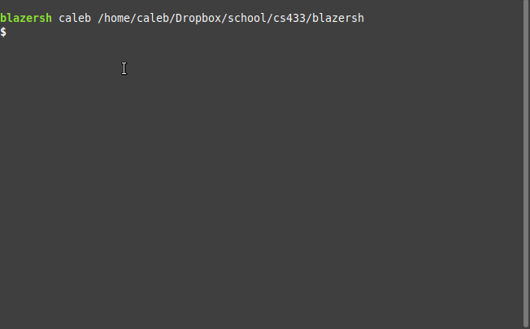

# blazersh

A shell implemented in C supporting quoting, escaping, pipes, background jobs, and file redirection. 
Part of UAB's CS-433 Operating Systems course. 

## Getting Started

This project depends on the `check` library 
(installation instructions <a href="https://libcheck.github.io/check/web/install.html">here</a>).

Build environment with
- `./configure`

Rebuild and compile with
- `make`

Optionally run tests with
- `make check`

After compiling, execute with
- `./src/blazersh`

## Testing

This project uses unit testing via the `check` library. To run these tests, run `make check`.
These tests can be viewed in tests/check_*.c

There are no integration tests or unit tests that directly check stdio or error 
handling.

